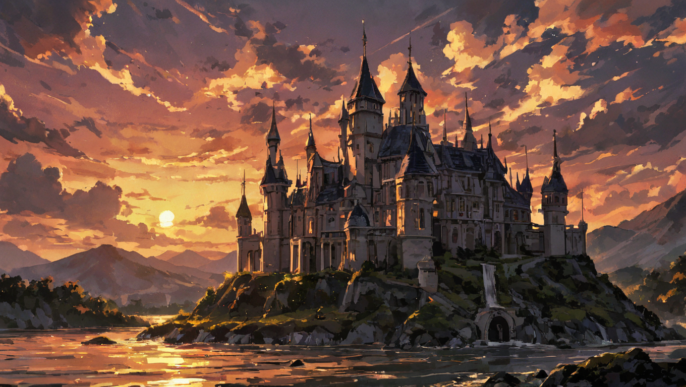

These images showcase castles surrounded by lush gardens, bathed in vibrant, natural light. The bright and cheerful atmosphere highlights the beauty and grandeur of these structures.

In contrast, these images depict castles with a more mysterious and somber tone. The use of shadows and darker lighting creates an atmosphere of intrigue and timelessness.

