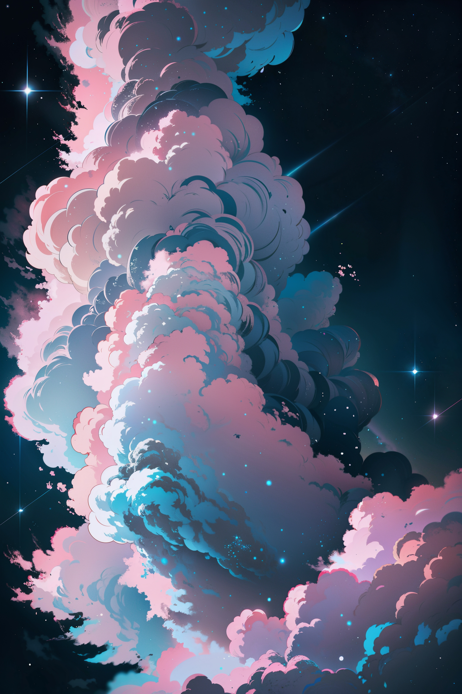

# **Unveiling the Art of Cloud Image Generation with LORA**

Clouds, those ever-changing wonders of the sky, have long captured the imagination of artists and enthusiasts alike. In this exploration of cloud image generation, we delve into the fascinating realm of using LORA (Low-Rank Adaptation) to craft clouds of varying styles and realism levels.

## **Introducing LORA: Revolutionizing Cloud Artistry**

LORA, short for Low-Rank Adaptation, is a groundbreaking technique in the field of artificial intelligence, particularly in the training and fine-tuning of large language models. This innovative method provides an efficient way to adapt these complex models without the need for extensive retraining, opening up new possibilities for creativity and expression.

## **Crafting Clouds with LORA: A Journey into Style and Imagination**

With LORA at your disposal, the possibilities for cloud image generation are limitless. By specifying parameters such as style, color, and background, users can harness the power of LORA to create clouds that reflect their artistic vision with remarkable precision.

## **Exploring Different Styles: From Dreamy Anime to Realism**

One of the defining features of LORA is its versatility in generating clouds of various styles and realism levels. For those seeking a dreamy, anime-inspired aesthetic, LORA can effortlessly conjure soft pink clouds against a backdrop of black starry skies, evoking a sense of whimsy and enchantment.

## **Tailoring Realism: Adjusting Keywords for Authenticity**

Moreover, LORA allows users to adjust the realism of the generated clouds by adding or removing keywords in the prompt. Whether aiming for hyper-realistic depictions or embracing a more stylized approach, LORA adapts to suit the desired level of authenticity, empowering users to create images that resonate with their artistic sensibilities.

## **Example Showcase: Realism vs. Animation**

Let's illustrate the versatility of LORA with examples. Using the prompt `<lora:bb3l15:1>, soft pink clouds, black starry background in the style of bb3l15`, we can generate clouds with a soft pink hue against a black starry background. When coupled with an anime model, the result is a dreamy, ethereal landscape perfect for creating personalized wallpapers.

In contrast, adjusting the prompt to prioritize realism, such as using the **Deliberate** model, yields a more lifelike depiction of clouds with nuanced textures and lighting. 

This demonstrates LORA's ability to cater to diverse artistic preferences, from whimsical animation to hyper-realism.

## **Unlocking Creativity: Personalized Art and Beyond**

Beyond mere image generation, LORA offers boundless opportunities for creative expression. Whether crafting digital art, designing wallpapers, or exploring new avenues of visual storytelling, LORA serves as a powerful tool for artists and enthusiasts to bring their ideas to life.

## **Embracing the Future of Cloud Artistry**

In conclusion, LORA represents a revolutionary approach to image generation, offering users unprecedented control and versatility in crafting *(in this case)* clouds of varying styles and realism levels. As we continue to push the boundaries of creativity and technology, let us embrace the transformative power of LORA to inspire new forms of artistic expression and imagination.