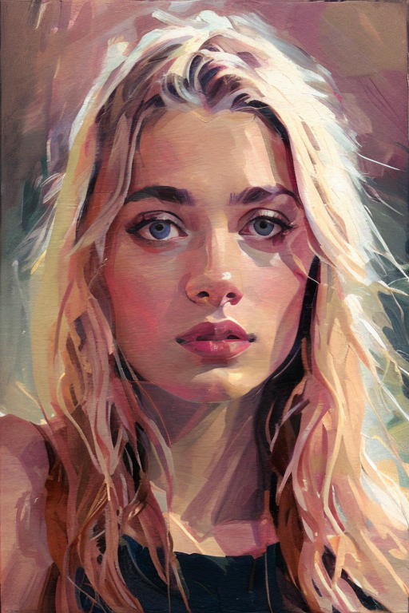

# Alberto Mielgo in Stable Diffusion

Alberto Mielgo is a highly acclaimed Spanish artist and filmmaker known for his distinctive and captivating artwork. His creations encompass a wide range of media, including animation, illustration, and painting. Mielgo's work is characterized by its bold, dynamic compositions, vibrant color palettes, and a fusion of both traditional and contemporary artistic techniques. His talent shines through in his ability to convey deep emotions and narratives through visuals, often evoking a sense of movement and surrealism. Notably, Mielgo received widespread recognition for his work on the animated anthology series "Love, Death & Robots," where his episode, "The Witness," won critical acclaim for its visually striking and suspenseful storytelling. His art continually pushes boundaries and challenges conventional artistic norms, making him a trailblazer in the world of contemporary art and animation.

The images depict Balkans, the Dalmatian coastal villages and the mountainous region of Montenegro (Црна Гора).

The Alberto Mielgo’s style can also be applied to other images, such as the ones which depict humans.

# The style of Ukiyo-e (浮世絵)

Ukiyo-e (浮世絵) is a traditional Japanese art form that originated in the Edo period (17th to 19th centuries). The term "ukiyo-e" translates to "pictures of the floating world." Ukiyo-e art captures scenes of daily life, landscapes, historical events, kabuki theater, beautiful women, and famous actors. These woodblock prints were mass-produced and widely distributed, making art more accessible to the general population.

## Shrines in the style of Ukiyo-e

## Picturesque mountains in the style of Ukiyo-e

