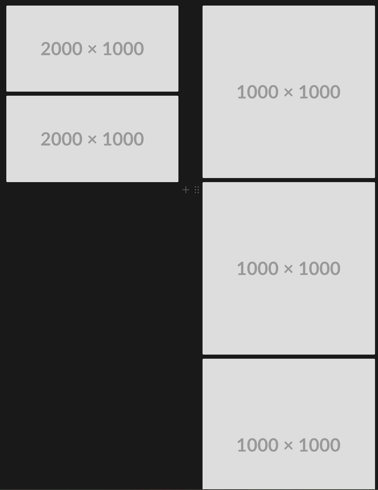
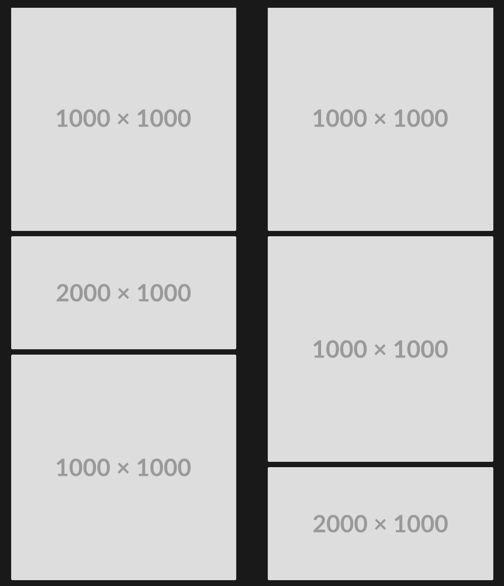

Optimizing images in a modern web project often feels like chasing the perfect balance between performance and aesthetics—until you realize how many hidden pitfalls lie beneath the surface. In my journey to build a visually striking Next.js site, I discovered that even powerful tools like next/image come with their own set of challenges, from **battling** layout shifts to **wrestling** with third-party masonry galleries that refused to cooperate. What started as a simple goal—to create a seamless, fast-loading image grid—turned into a deep dive into aspect ratios, lazy loading **quirks**, and the surprising importance of pixel-perfect placeholders. Here’s how I navigated **broken** npm packages, **reinvented** a masonry layout **from scratch**, and learned that sometimes, the right solution isn’t just about using the right tools—it’s about **bending them to your will**.

# Why use `next/image`?

1. **Performance Optimization**: Automatic resizing and modern format support.
2. **Lazy Loading**: Images load only when visible in the view-port.
3. **Responsive Design**: Simplifies handling multiple device sizes.
4. **CDN Support**: Automatically serves optimized images from a CDN.

# Important notes regarding properties

## `src`

For external URLs, you need to configure the `domains` in `next.config.js`.

## `priority`

Prefetches the image for better performance on critical assets.

Useful for above-the-fold images.

## `Built-in caching`

Images are cached automatically by Next.js in `<distDir>/cache/images` — you don't need to do anything to make this happen.

# Creating a masonry gallery

I always thought that masonry galleries are cool. So I thought I might use one. It didn’t work so great when I installed one from an npm package, so I thought I might create one myself. I figured I would create a vertical one (it is easier to do).

Creating the columns is quite easy, we just create a grid. Displaying images in a column isn’t a big deal either. Using flex we can make sure they neatly follow each other.

```tsx
<div className="grid grid-cols-1 gap-4 sm:grid-cols-2 md:grid-cols-3 lg:grid-cols-4">
  {/* Dispaly rows, i.e. loop over image columns */}
  {images.map((imageColumn, index) => (
    <div key={index} className="flex flex-col gap-4">
      {/* Loop over the images in the column */}
      {imageColumn.map((image) => (
        <div
          key={image.key}
          className="group relative h-auto w-full cursor-pointer overflow-hidden rounded-lg"
          onClick={() => openModal(image)}
        >
          <Image
            className="!relative h-auto w-full object-cover transition-transform duration-300 group-hover:scale-110"
            src={image.src}
            alt={image.alt}
            fill
            loading="lazy"
            sizes="(max-width: 640px) 100vw, (max-width: 768px) 50vw, (max-width: 1024px) 33vw, 25vw"
          />
          <div className="absolute inset-0 flex items-center justify-center bg-black opacity-0 transition-opacity duration-300 group-hover:opacity-50">
            <span className="text-lg font-semibold text-white opacity-0 transition-opacity duration-300 group-hover:opacity-100">
              View
            </span>
          </div>
        </div>
      ))}
    </div>
  ))}
</div>
```

The big question is how to distribute the images **_between_** the columns.

The task is to split the columns evenly, so visually they all appear the same length.

> _But what do we base it on?_

Well you can’t base it on height nor width, they are dynamic. They change based on the size of the window. What we actually need is the **ratio**. \*\*\*\*However, we do not want the aspect ratio of width divided by height, we need the ratio of height divided by width.

This is because what we actually need is how much longer/shorter is the height of the image compared to the width. The width in our case is the same for all images, but the height depends on the image’s aspect ratio.

1000 x 1000 image has an aspect ratio of 1:1 or width/height = 1

2000 x 1000 image has an aspect ratio of 2:1 or width/height = 2

So if we had images with width/height ratio:

- 4 images with 1
- 2 images with 2

It would seem like we have a total of `4 x 1 + 2 x 2 = 8`, which in turn would mean that we could possibly put all images with aspect ratio of 1 into one column and all images with aspect ratio of 2 into another, but that would be **WRONG!** This is how it would look like:



But if we calculate the aspect ratio as height divided by width, we get this:

`4 x 1 + 2 x 1/2 = 5`

This suggests that we can split it equally if we have the aspect ratios sum on both sides equal to 2.5. This way it could look something like this:



After torturing my coding assistants for a few hours **we** came up with this:

```tsx
const splitImageArray = (
  imageList: {
    src: string;
    alt: string;
    width: number;
    height: number;
    key: string;
  }[],
  columnCount: number,
) => {
  if (columnCount < 2) {
    return [imageList];
  }
  // calculate the apsect ratio for each image
  const list = imageList.map((image) => ({
    ...image,
    aspectRatio: image.height / image.width,
  }));

  const columns = Array.from({ length: columnCount }, () => Array<TImage>());
  const columnAspectSums = Array<number>(columnCount).fill(0);

  for (const image of list) {
    let targetColumnIndex = 0;
    let minAspectSum = columnAspectSums[0];
    // loop through columns to see which one is the shortest
    for (let i = 1; i < columnCount; i++) {
      if (columnAspectSums[i]! < minAspectSum!) {
        targetColumnIndex = i;
        minAspectSum = columnAspectSums[i];
      }
    }
    // add image to the shortest column
    columns[targetColumnIndex]!.push(image);
    columnAspectSums[targetColumnIndex]! += image.aspectRatio;
  }

  return columns;
};
```

# The importance of saving the information about the image

There is this issue with images that are not stored with the code. First of all, you don’t really know the actual size of the image. This has a lot of side effects. Luckily, you may think, I can use the fill property of Next.js image or just a default width and height. I thought so too. This brings an issue, you see, the image then creates **Cumulative Layout Shift**, which looks very bad on your lighthouse report 🙃. Looks bad when browsing too, not just on the report!

Let’s say you have a blog, and cache the images on cloudinary. Hypothetically, you could just use the links to the images. However, it seems reasonable to assume that it would be wise to store the information about the image in a database, and then retrieve that information, like alternative text, width, height, and maybe something more!

# Placeholders

Let’s say you wanted to improve the service to the not so fortunate customers that are in the middle of nowhere or just happen to have very slow internet. You could add placeholder images for your actual images! There is a library called **Plaiceholder** for that.

So let’s say you have an image. You know just the URL (and maybe alternative text). You could build something like this:

```tsx
export async function getImage(src: string) {
  const buffer = await fs.readFile("./public/" + src);

  const {
    metadata: { height, width },
    ...plaiceholder
  } = await getPlaiceholder(buffer, { size: 10 });

  return {
    ...plaiceholder,
    img: { src, height, width },
  };
}
```

From **Plaiceholder** you get the height, the width, the source, and the **Plaiceholder** object:

```tsx
{
  color: {
    r: number;
    g: number;
    b: number;
    hex: string;
  };
  css: {
    backgroundImage: string;
    backgroundPosition: string;
    backgroundSize: string;
    backgroundRepeat: string;
  };
  base64: string;
  pixels: {
    a?: number;
    r: number;
    g: number;
    b: number;
  }[][];
  svg: GetSVGReturn;
}
```

Setting the `placeholder` to `blur` and `blurDataURL` to the `base64` that we get from the **Plaiceholder.**

```tsx
<Image
  src={image.src}
  alt={image.alt}
  width={image.width}
  height={image.height}
  loading="lazy"
  sizes="(max-width: 640px) 100vw, (max-width: 768px) 50vw, (max-width: 1024px) 33vw, 25vw"
  placeholder="blur"
  blurDataURL={image.base64}
/>
```

Finally, what we have is a beautiful flow, where the user sees a blurred version of the image while it is loading, and then when it is loaded fully, the image itself appears. This will not be quite visible on faster internet, as the images on the page are already pretty small due to the format. However, on slow devices this looks pretty!
